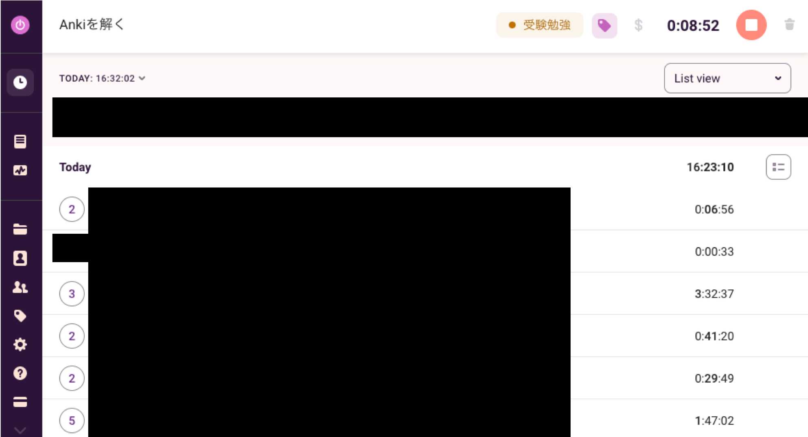

# Appendix A: 「ジョージア工科大学に合格するまでの572時間29分02秒」の作り方

!!! Summary
    - [Todoist](https://todoist.com/ja)と[Toggl track](https://toggl.com/track/)を[Chrome拡張機能](https://todoist.com/ja/help/articles/use-toggl-track-with-todoist)で連携させて作業時間を記録し，[Toggl API](https://github.com/toggl/toggl_api_docs)でデータを取得
    - 上記のデータを前処理した後，[plotly](https://plotly.com/python/)でインタラクティブなグラフを生成し，[mkdocs-macros](https://mkdocs-macros-plugin.readthedocs.io/en/latest/)で埋め込み
    - [MkDocs](https://www.mkdocs.org/)で静的サイトのコンテンツを生成し，[GitHub Pages](https://docs.github.com/ja/pages)にホスティング

## 概要

このページでは，本サイト
「ジョージア工科大学に合格するまでの572時間29分02秒」
を構築するために必要だった準備をまとめます．

まず必要なのは作業時間の記録です．
私は，
[Todoist](https://todoist.com/ja)
のタスクを
[Chrome拡張機能](https://todoist.com/ja/help/articles/use-toggl-track-with-todoist)
を使って
[Toggl track](https://toggl.com/track/)
と連携することで，作業時間を記録しました．
記録したデータは，
[Toggl API](https://github.com/toggl/toggl_api_docs)
を用いてダウンロードしました．

上記のデータを前処理した後で，
[plotly](https://plotly.com/python/)
を用いてインタラクティブなグラフをHTMLファイルとして出力しました．
上記のHTMLファイルを，後述する
[mkdocs-macros](https://mkdocs-macros-plugin.readthedocs.io/en/latest/)
を使ってサイトの本文に埋め込むために，
`<HTML>`タグや`<BODY>`タグを削除する必要がありました．

[MkDocs](https://www.mkdocs.org/)
を使って静的サイトのコンテンツを生成し，
[GitHub Pages](https://docs.github.com/ja/pages/getting-started-with-github-pages/about-github-pages)
にデプロイしました．

## Todoist & Toggl track

[Todoist](https://todoist.com/ja)
のタスクを
[Chrome拡張機能](https://todoist.com/ja/help/articles/use-toggl-track-with-todoist)
を使って
[Toggl track](https://toggl.com/track/)
と連携することで，作業時間を記録しました．

[Todoist](https://todoist.com/ja)
はタスク管理アプリです．
私は「受験勉強」プロジェクトを作成し，OMSCS出願に関する全てのタスクを管理しました．

!!! Note
    私はプロプランを契約していますが，[フリープランでもプロジェクト機能は利用可能](https://todoist.com/ja/pricing)らしいです．

[Toggl track](https://toggl.com/track/)
は，タイムトラッキングアプリです．
私はこのアプリを使って，2019年ごろから現在まで24時間365日，秒単位で全ての作業時間を記録しています．

[Chrome拡張機能](https://todoist.com/ja/help/articles/use-toggl-track-with-todoist)
を用いることで，TodoistとToggl trackを連携しました．
具体的には，Todoist上の各タスク上でTogglボタンを押下することで，当該タスクのプロジェクトとタスク名で作業時間を記録しました．

例えば，Ankiを解き始める時に，下記のようにTogglボタンを押下すると，

下記のように，Toggl trackで「受験勉強」プロジェクトの「Ankiを解く」作業時間の記録が開始されます．

Toggl trackのWeb画面では，下記のように表示されます．

Toggl trackのデータは，
[Toggl API](https://github.com/toggl/toggl_api_docs)
を用いてダウンロードしました．
このデータを前処理した後，plotlyでグラフを描画しました．

## plotly

上記のデータを元に，[plotly](https://plotly.com/python/)でインタラクティブなグラフを描画し，HTMLファイルとして出力しました．
ベーシックなグラフしか利用していないため，plotly公式のサンプルをご覧になればなんとなく作成方法はご理解頂けると思います．

!!! Note
    実は曜日ごとの作業時間や，時間帯ごとの作業時間を[Ridgeline plot](https://plotly.com/python/violin/#ridgeline-plot)で描画したりしましたが，労力の割に面白い結果が得られなかったため，割愛しました．

### 「作業時間の推移」の作成方法

[Basic Range Slider and Range Selectors](https://plotly.com/python/range-slider/#basic-range-slider-and-range-selectors)のサンプルをベースに，下記のような修正を加えました．

- 「TOEFL受験」等の縦方向の点線とアノテーションを追加：[Horizontal and Vertical Lines and Rectangles in Python](https://plotly.com/python/horizontal-vertical-shapes/)
- ホバー時に合計作業時間を表示（`hovermode="x unified"`）：[Unified hovermode](https://plotly.com/python/hover-text-and-formatting/#unified-hovermode)
- 下部にDate range sliderを追加：[Basic Range Slider and Range Selectors](https://plotly.com/python/range-slider/#basic-range-slider-and-range-selectors)



### 「作業時間の内訳」の作成方法

[Bar chart with plotly Express](https://plotly.com/python/bar-charts/#bar-chart-with-plotly-express)のサンプルをベースに，下記のような修正を加えました．

- ホバー時に合計作業時間を表示（`hovermode="x unified"`）：[Unified hovermode](https://plotly.com/python/hover-text-and-formatting/#unified-hovermode)



### 「作業時間の内訳の推移」の作成方法

[Stacked Bar Chart](https://plotly.com/python/bar-charts/#stacked-bar-chart)のサンプルをベースに，下記のような修正を加えました．

- 「TOEFL受験」等の縦方向の点線とアノテーションを追加：[Horizontal and Vertical Lines and Rectangles in Python](https://plotly.com/python/horizontal-vertical-shapes/)
- ホバー時に合計作業時間を表示（`hovermode="x"`）：[Hovermode x or y](https://plotly.com/python/hover-text-and-formatting/#hovermode-x-or-y)
- 下部にDate range sliderを追加：[Basic Range Slider and Range Selectors](https://plotly.com/python/range-slider/#basic-range-slider-and-range-selectors)



### HTMLを埋め込むための加工

後述するように，本サイトではplotlyが出力したHTMLファイルを
[MkDocs](https://www.mkdocs.org/)
の
[mkdocs-macros](https://mkdocs-macros-plugin.readthedocs.io/en/latest/)
というプラグインを用いて埋め込みました．
そのための前処理として，埋め込みたい
[HTMLファイルから`<HTML>`タグと`<BODY>`タグを削除する必要がありました](https://mkdocs-macros-plugin.readthedocs.io/en/latest/advanced/#other-uses)．

## MkDocs

[MkDocs](https://www.mkdocs.org/)
を使って静的サイトのコンテンツを生成しました．
MkDocsを選択した理由は下記です．

- デフォルト設定でかなり素敵な静的サイトが作れる
- コマンド一つ（`mkdocs gh-deploy`）で簡単にGitHub Pagesをデプロイできる

以下では，本サイトにおけるMkDocsの設定情報をまとめます．

### `mkdocs.yml`

MkDocsでは，ルートディレクトリの`mkdocs.yml`で各種設定を行います．
設定にあたっては，
[mebiusbox, MkDocsによるドキュメント作成](https://zenn.dev/mebiusbox/articles/81d977a72cee01)
を参考にさせて頂きました．
ありがとうございました．

前述したように，本サイトでは
`include`文でplotlyが出力したHTMLファイルを埋め込めるように，
[mkdocs-macros](https://mkdocs-macros-plugin.readthedocs.io/en/latest/)
プラグインを利用しました（63行目付近）．

### `docs/css/custom.css`

本サイトでは，下記のようなカスタムCSSを利用しました．
こちらに関しても，
[mebiusbox, MkDocsによるドキュメント作成](https://zenn.dev/mebiusbox/articles/81d977a72cee01)
を参考にさせて頂きました．
ありがとうございました．

## GitHub Pages

本サイトは，
[GitHub Pages](https://docs.github.com/ja/pages/getting-started-with-github-pages/about-github-pages)
でホスティングしています．
作成方法の詳細は[GitHub Docs, GitHub Pages サイトを作成する](https://docs.github.com/ja/pages/getting-started-with-github-pages/creating-a-github-pages-site)をご参照ください．

