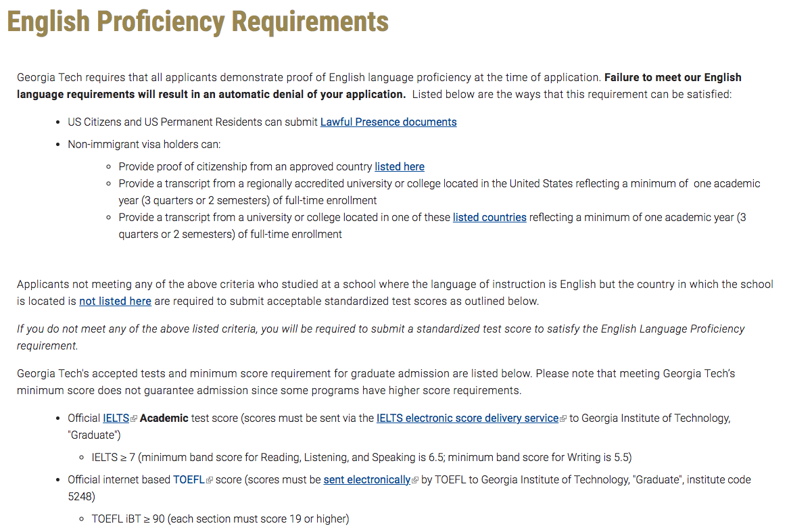

# Appendix B: 参考資料

!!! Summary
    - OMSCSに問い合わせたところ，TOEFL iBTの打ち切り点数は合計90点以上（各セクション19点以上）らしい
    - 2020年7月頃は本業上の炎上と[Personal Statement](https://kakeami.github.io/road-to-gatech/ps/)の迷走が重なり，かなり辛い時期でした

## TOEFL iBTの足切り

TOEFL iBTの結果が出た2020年7月頃，ジョージア工科大学の公式サイトには2種類のTOEFL Requirementsが存在していました．

一つ目は，[Computer Science (Online)のTOEFL Requirements](https://grad.gatech.edu/degree-programs/computer-science-online)で，こちらには**100点**（各セクション最低19点）と記載されていました．

一方で，ジョージア工科大学全体の[English Proficiency Requirements](https://grad.gatech.edu/english-proficiency)には**90点**（各セクション最低19点）と記載されていました．

悩ましいことに，私の点数はその中間の**93点**でした（各セクションの最低点はクリアしていました）．
普通に考えると100点を取得するまで再受験するべきなのですが，受験料が高いため，ダメ元で[OMSCS](https://pe.gatech.edu/degrees/computer-science/contact-us?utm_source=omscs.gatech.edu/accessibility-requirements/contact-us&utm_medium=referral&utm_campaign=omscs)に問合せました．
翌日2020年6月20日，下記のような回答を頂きました．

> OMSCS applicants must meet at least the institute minimum TOEFL score for review (overall score of 90 with a minimum of 19 in each subcategory).

93点のまま出願できそう，ということがわかったため，再受験は一旦保留しました．

!!! Note
    念の為[Listening](https://kakeami.github.io/road-to-gatech/toefl-l/)・[Speaking](https://kakeami.github.io/road-to-gatech/toefl-s/)・[Vocabulary](https://kakeami.github.io/road-to-gatech/toefl-v/)の対策は継続しました．

## 睡眠時間の推移

より臨場感を持って本サイトをご覧頂くため，睡眠時間の推移を以下に示します．



まず注目して頂きたいのは，睡眠時間が極端に短い2020年7月21日です．
原因は本業の大炎上で，鎮火まで1週間ほどかかりました．
[Personal Statement](https://kakeami.github.io/road-to-gatech/ps/)で迷走し，[タスクを再整理していた](https://kakeami.github.io/road-to-gatech/misc/)時期と重なりました．
この頃は精神的にかなり参っていたので，家族には出願を諦めると話しました．

次に注目して頂きたいのは，お正月以外で睡眠時間が極端に長い日です．
2019年12月17日は，胃腸炎で38度の高熱を出して寝込みました．
2021年3月22日および20201年3月23日は，出願後に緊張の糸が切れて，風邪を引いてしまいました．

まあ，だからなんだという感じですが…．
